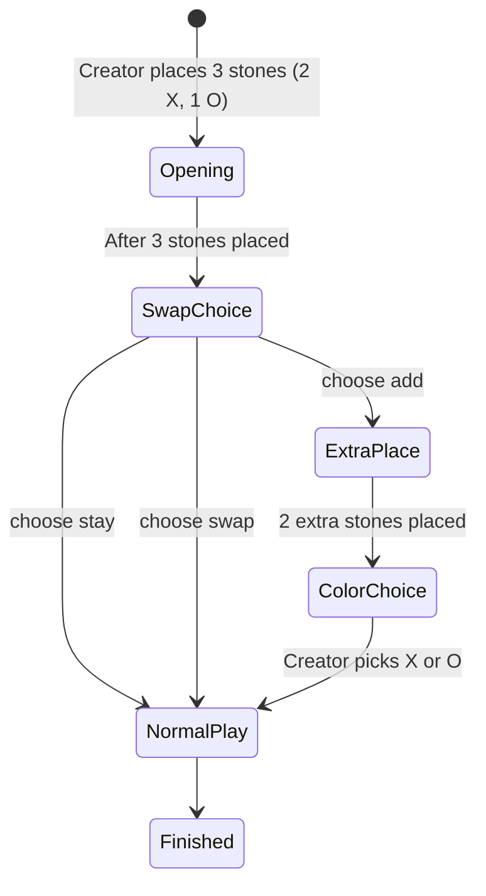

# 🎮 Ōkinoko In-A-Row

### *On-Chain Turn-Based Game Engine — TicTacToe | ConnectFour | Gomoku (Swap2 Freestyle)*

Ōkinoko is a fully on-chain, trustless, and deterministic game engine supporting multiple abstract strategy games with provable fairness. All moves, win detection, betting logic, and timeouts are enforced at the smart contract level.

Players interact via WASM-exported functions with human-readable `|`-delimited strings. No off-chain components are required for gameplay.

🌐 A graphical interface will be available soon at: **[https://terminal.okinoko.io/](https://terminal.okinoko.io/)**

🧭 Project Ethos: **No rake. No hidden fees. 100% fair.** Donations to tibfox.vsc would be highly appreciated ;)


---

# 📦 Supported Game Types

| Value | Game                     | Board Size | Win Condition | Opening Rule              |
| ----- | ------------------------ | ---------- | ------------- | ------------------------- |
| 1     | [Tic Tac Toe](https://en.wikipedia.org/wiki/Tic-tac-toe)                | 3×3        | 3 in a row    | Standard                  |
| 2     | [Connect Four / Vier Gewinnt](https://en.wikipedia.org/wiki/Connect_Four)             | 6×7        | 4 in a row    | Gravity disc drop         |
| 3     | [Gomoku (Swap2 Freestyle Rules)](https://en.wikipedia.org/wiki/Gomoku) | 15×15      | 5 in a row    | Fairness-enforced opening |

---

# 🚀 Exported Functions

All inputs are `|`-delimited UTF-8 strings.
All returns are strings or `nil`.

## 1. `g_create` - Create Game

```
"type|name"
```

Returns: `"<gameId>"`

---

## 2. `g_join` - Join Game

```
"gameId"
```

Returns: `nil` on success

If Gomoku: automatically enters **Swap2 opening phase**.

---

## 3. `g_swap` - Swap Opening (Gomoku Only)

| Stage        | Input Format                | Description|
| ------------ | --------------------------- | -----------|
| Opening      | `id\|place\|row\|col\|cell` | Creator places 3 stones (2 X, 1 O)   |      |                   |
| Swap Choice  | `id\|choose\|swap\|stay\|add` | Opponent reaction |
| Extra Stones | `id\|add\|row\|col\|cell`   | If `add` chosen, place 2 more stones |      |                   |
| Final Color  | `id\|color\|1 or 2`         | Creator chooses final color          |      |                   |

After completion: normal play begins.

---

## 4. `g_move` - Make Move

```
"gameId|row|col"
```

Returns: `nil`

Automatically enforces turn rules, win detection, betting payouts.

---

## 5. `g_timeout` - Claim Timeout

```
"gameId"
```

If opponent exceeds 7 days without a move → caller wins.

---

## 6. `g_resign` - Resign

```
"gameId"
```

Caller resigns; opponent is immediately declared the winner.

---

## 7. `g_get` - Get Game State

```
"gameId"
```

**Output Format:**

```
id|type|name|creator|opponent|rows|cols|turn|moves|status|winner|betAsset|betAmount|lastMoveAt|<BoardContent>
```

* `BoardContent`: row-wise ASCII digits (`0=empty`, `1=X`, `2=O`)

---

## 8. `g_waiting` - List Waiting Games

Returns comma-separated IDs:

```
"0,5,7"
```

> Order is not guaranteed (gas-optimized). Client may sort if required.

---

# 🔄 Unified Game Lifecycle

```text
Create (g_create)
   ↓
WaitingForPlayer
   ↓ g_join
InProgress
   ↓ (If Gomoku) g_swap phases
Normal Play (g_move)
   ↓
Win / Draw / Resign / Timeout
   ↓
Finished
```

---

# ♟ Gomoku Swap2 Freestyle State Machine



### ASCII Flow Summary

```text
[Opening: place 3 stones] -> [SwapChoice:
     stay -> normal play
     swap -> normal play (roles flipped)
     add  -> extra placement phase -> color choice -> normal play]
```

---

# 📄 Example: Gomoku Setup with Swap2 “Add → Color 2”

```
g_create: "3|Gomoku"
g_join:   "0"
g_swap:   "0|place|7|7|1"
g_swap:   "0|place|7|8|2"
g_swap:   "0|place|8|7|1"
g_swap:   "0|choose|add"
g_swap:   "0|add|8|8|2"
g_swap:   "0|add|6|7|1"
g_swap:   "0|color|2"
g_move:   "0|10|7"  ← First normal move (Bob plays X)
```

---

# ⚙ Status & Turn Codes

| Status | Meaning            |
| ------ | ------------------ |
| 0      | Waiting for Player |
| 1      | In Progress        |
| 2      | Finished           |

| Turn | Player |
| ---- | ------ |
| 1    | X      |
| 2    | O      |

---

# 💰 Optional Betting (Transfer Intents)

| Element | Description        |
| ------- | ------------------ |
| Token   | `hive` or `hbd`    |
| Limit   | Bet amount (float) |

✅ Bet is locked when creating or joining
✅ Winner takes full pot
✅ Draw splits pot evenly
❌ No rake taken by contract (player-first model)

> Players may support development voluntarily

---

# 🔐 Timeout Rules

| Parameter | Value                      |
| --------- | -------------------------- |
| Timeout   | 7 days                     |
| Eligible  | Only the waiting player    |
| Effect    | Instant win & pot transfer |


---

# 📜 License

MIT License — free to use, modify, and build upon.
