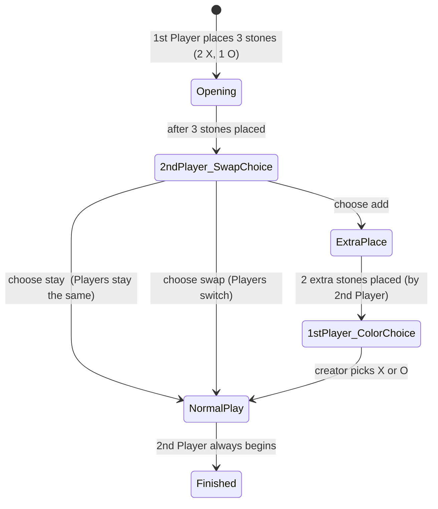

# 🎮 Ōkinoko In-A-Row

### *On-Chain Turn-Based Game Engine — TicTacToe · Connect Four · Gomoku (Swap2) · Squava*

**Ōkinoko In-A-Row** is a fully on-chain, trustless, and deterministic game engine for abstract strategy games.  Every move, win condition, and bet payout is validated by the smart contract itself - no servers, no middlemen.

🕹️ **Play at:** [Ōkinoko Terminal](https://terminal.okinoko.io/)  
⚖️ **Games:** TicTacToe · TicTacToe5 · Connect Four · Gomoku (Swap2 Freestyle) · Squava  
💰 **Fair Play:** Optional betting, first move swaps, provable fairness, no rake, no hidden fees.  
📜 **Tech:** WebAssembly (WASM) exports · Binary-optimized storage · Off-chain indexer for UX.  

---


Players interact through WASM-exported functions using human-readable, `|`-delimited UTF-8 strings. An external **indexer** is required for optimal UX and visualization.

🌐 Play in the browser via **[Ōkinoko Terminal](https://terminal.okinoko.io/)**.
🧭 **Project ethos:** *No rake. No hidden fees. 100 % fair.*
💖 Donations to **`tibfox.vsc`** are always appreciated.

---

## 📦 Supported Game Types

| Value | Game                                                                      | Board   | Win Condition          | Opening Rule                                                           | Special Lose Condition |
| ----- | ------------------------------------------------------------------------- | ------- | ---------------------- | ---------------------------------------------------------------------- | ---------------------- |
| 1     | [Tic Tac Toe](https://en.wikipedia.org/wiki/Tic-tac-toe)                  | 3 × 3   | 3 in a row             | FMP or Standard                                                        | –                      |
| 2     | [Connect Four / Vier Gewinnt](https://en.wikipedia.org/wiki/Connect_Four) | 6 × 7   | 4 or more in a row     | FMP or Standard                                                        | –                      |
| 3     | [Gomoku Freestyle](https://en.wikipedia.org/wiki/Gomoku)                  | 15 × 15 | 5 or more in a row     | FMP + [Swap2](https://en.wikipedia.org/wiki/Gomoku#Swap2) fair opening | –                      |
| 4     | Tic Tac Toe 5                                                             | 5 × 5   | 4 or more in a row     | FMP or Standard                                                        | –                      |
| 5     | [Squava](https://nestorgames.com/rulebooks/SQUAVA_EN.pdf)                 | 5 × 5   | 4 or more in a row     | FMP or Standard                                                        | **Lose if 3 in a row** |
| 6     | [Gomoku Standard](https://en.wikipedia.org/wiki/Gomoku)                   | 15 × 15 | **Exactly 5 in a row** | FMP + Swap2 opening                                                    | –                      |

**FMP (First Move Purchase):**
For greater fairness, the creator can define a “first move cost.”
The joiner may pay this optional fee (in the game’s token) to buy the first move.
Available only when the game has a bet and therefore a defined asset.

---

## 🧩 Indexers

Ōkinoko stores game data in **binary format** for gas efficiency. This means game details are **not directly queryable** via standard GraphQL methods.

An **off-chain indexer** must parse emitted logs and expose them as structured data. For best results, use the [Ōkinoko Terminal](https://terminal.okinoko.io/) — it’s already connected to a wip indexer.

*(Avoid the use of `g_get`, as it consumes significant gas.)*

---

## 🚀 Exported Functions

All inputs are `|`-delimited UTF-8 strings.
All return values are strings or `nil`.

### 1. `g_create` — Create a Game

```
"type|name|0.01"
```

Returns → `<gameId>`

The last parameter defines the optional **First Move Purchase** (FMP) amount.
This only applies if the game includes a bet.

---

### 2. `g_join` — Join a Game

```
"gameId"
```

Returns → `nil` on success

If the joiner pays the FMP amount, they earn the **right to move first**.
For Gomoku, joining automatically enters the **Swap2 opening phase**.

---

### 3. `g_swap` — Swap Opening *(Gomoku only)*

| Stage        | Input Format                                             | Description                                                   |
| ------------ | -------------------------------------------------------- | ------------------------------------------------------------- |
| Opening      | `id\|place\|row-col-color\|row-col-color\|row-col-color` | First player places 3 stones (2 of one color, 1 of the other) |
| Swap Choice  | `id\|choose\|swap \| stay \| add`                        | Second player’s decision                                      |
| Extra Stones | `id\|add\|row-col-color\|row-col-color`                  | If “add” chosen, place 2 additional stones                    |
| Final Color  | `id\|color\|1 or 2`                                      | First player selects their final color                             |

After the Swap2 sequence completes, normal play begins.

---

### 4. `g_move` — Make a Move

```
"gameId|row|col"
```

Automatically validates turns, detects wins/draws, and processes payouts.

---

### 5. `g_timeout` — Claim Timeout

```
"gameId"
```

If an opponent is inactive for **7 days**, the caller can claim a timeout win.

---

### 6. `g_resign` — Resign Game

```
"gameId"
```

Caller resigns; opponent is immediately declared the winner.

---

### 7. `g_get` — Retrieve Game State

```
"gameId"
```

**Output:**

```
id|type|name|creator|opponent|rows|cols|turn|moves|status|winner|betAsset|betAmount|lastMoveAt|<BoardContent>
```

`BoardContent` → row-wise ASCII digits (`0=empty`, `1=X`, `2=O`)

---

## 🔄 Unified Game Lifecycle

```text
Create (g_create)
   ↓
Waiting for Player
   ↓ g_join
In Progress
   ↓ (if Gomoku) Swap2 phases
Normal Play (g_move)
   ↓
Win / Draw / Resign / Timeout
   ↓
Finished
```

---

## ♟ Gomoku Swap2 Freestyle State Machine



(In most cases the 1st player is the creator of the game. But in case o FMP the joiner is the 1st player.)

---

## 📄 Example — Gomoku Setup (Swap2 Add → Color 2)

```
g_create: "3|Gomoku"
g_join:   "0"
g_swap:   "0|place|7-7-1|7-8-2|8-7-1"
g_swap:   "0|choose|add"
g_swap:   "0|add|8-8-2|6-7-1"
g_swap:   "0|color|2"
g_move:   "0|10|7"  ← first normal move (Bob plays X)
```

---

## ⚙ Status & Turn Codes

| Status | Meaning            |
| ------ | ------------------ |
| 0      | Waiting for Player |
| 1      | In Progress        |
| 2      | Finished           |

| Turn | Player |
| ---- | ------ |
| 1    | X      |
| 2    | O      |

---

## 💰 Optional Betting (Intents)

| Field | Meaning            |
| ----- | ------------------ |
| Token | `hive` or `hbd`    |
| Limit | Bet amount (float) |

* Bets are locked upon creation or joining
* Winner takes the full pot
* Draw splits pot 50 / 50
* **No rake** — player-first design

If the joiner pays an **FMP**, that amount transfers to the original first player.

---

## 🔐 Timeout Rules

| Parameter | Value                      |
| --------- | -------------------------- |
| Timeout   | 7 days                     |
| Eligible  | Only the waiting player    |
| Effect    | Instant win + pot transfer |

---

## 📜 License

**MIT License** — free to use, modify, and build upon.